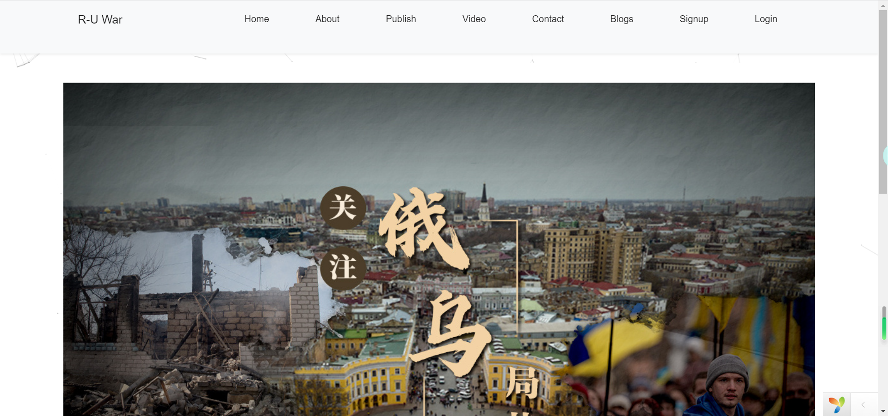
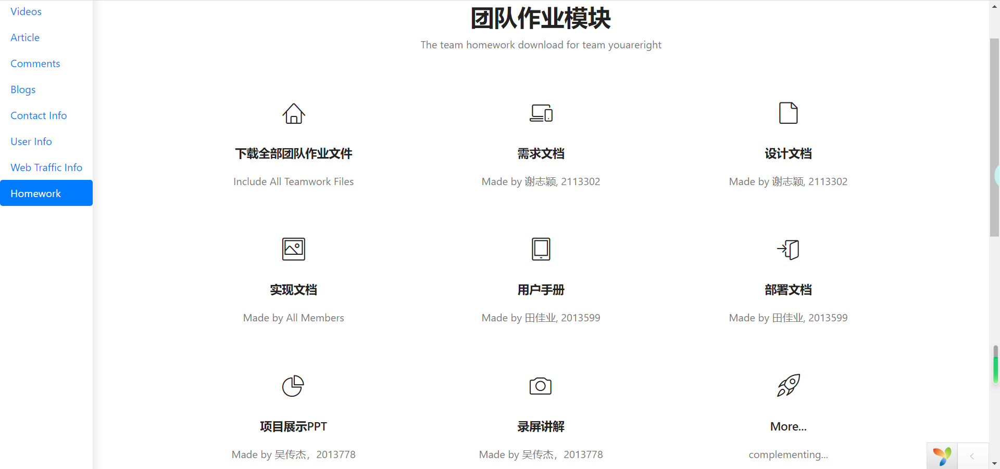

<h3 align="center">俄乌战争论坛</h3>
<h6 align="center">《互联网数据库开发》团队-你说的都队</h6>

For *Internet Datebase Development* 2022 Fall @Nankai University,
By [吴传杰](https://github.com/Metreacs), [谢志颖](https://github.com/0Jasmine), [田佳业](https://github.com/Lunaticsky-tql)
 

>[前台](http://8.130.17.136/RUW/frontend/web/) [后台](http://8.130.17.136/RUW/backend/web)

>❗❗作业可在[这里](http://8.130.17.136/RUW/data)下载，存储于data文件夹下

网站简介😄
----------

本网站以“俄乌战争”为主题，主要分为前台、后台两个部分。
用户可以进入前台进行登陆注册，来获得后台的访问权限，在前台可了解关于俄乌战争的基本信息以及相关的热点；在article和video页面还可以看到与此相关的视频和文章。
进入后台时需要用户登陆后才可以进行访问，可以查看网站访问量；发布文章、视频、博客等等；查看前台留下的评论和使用者的信息、网络流量信息和团队的作业等。

>[用户手册看这里！](data/team/你说的都队_用户手册(2013778_2113302_2013599).pdf)
---

